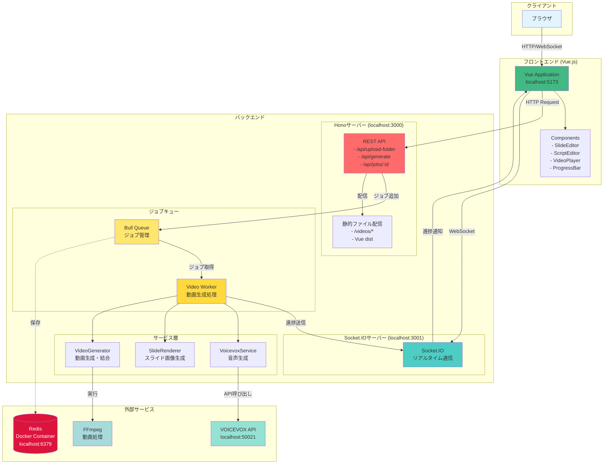
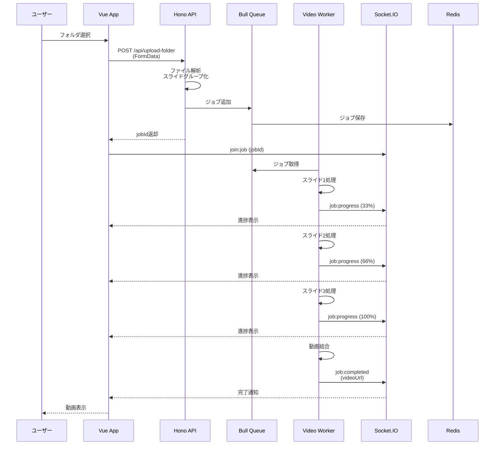
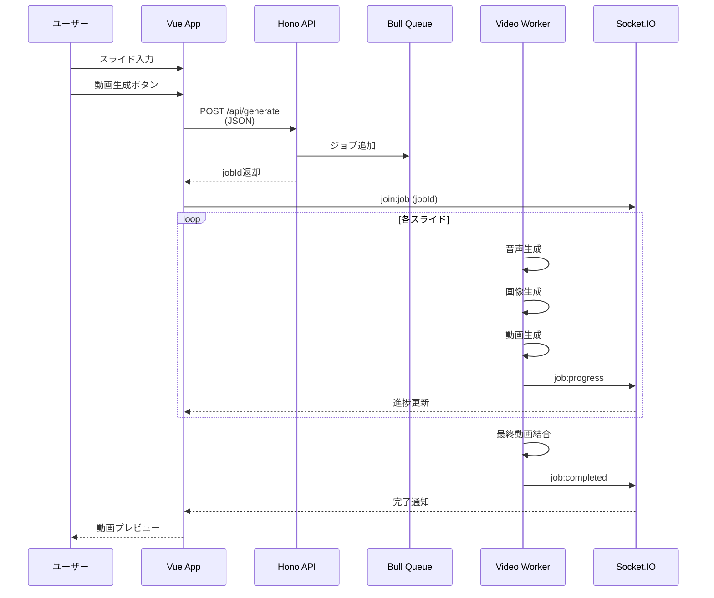
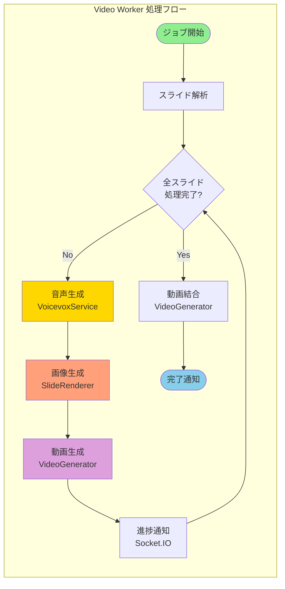
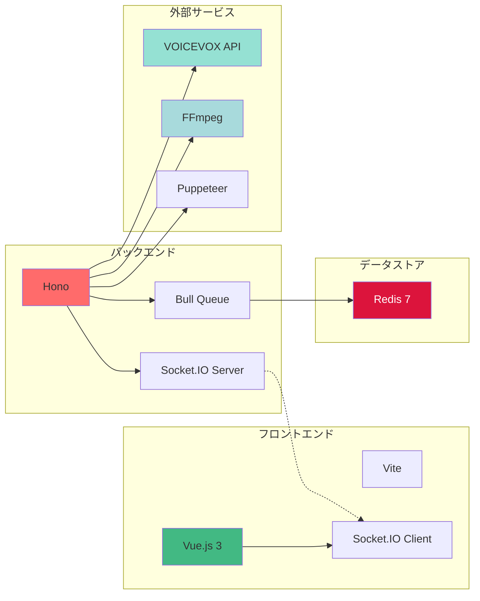
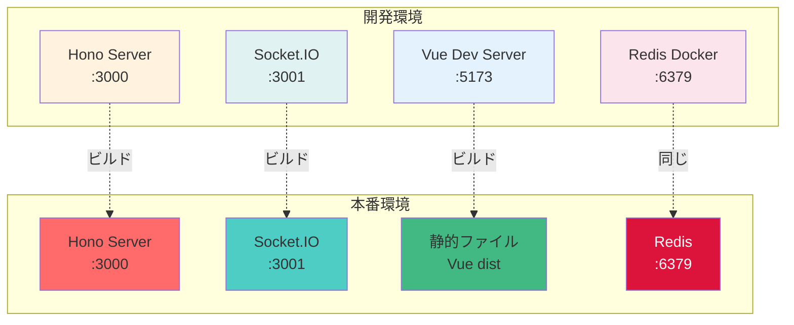
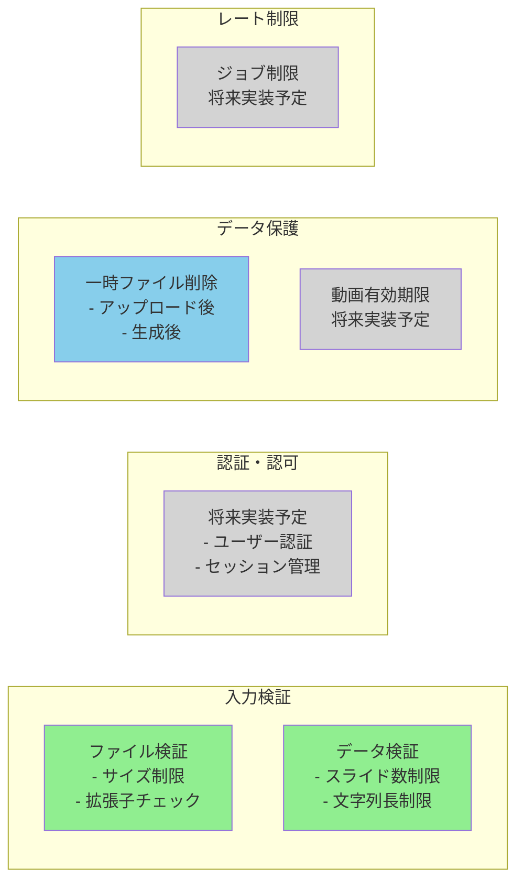
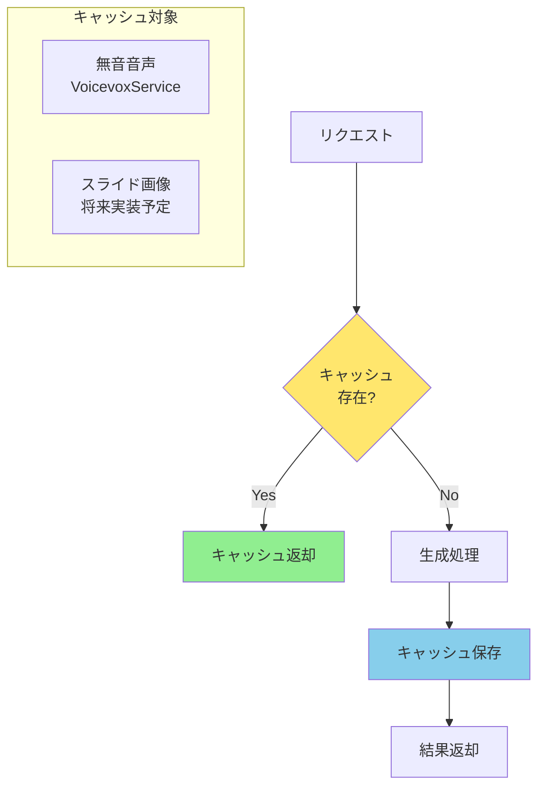
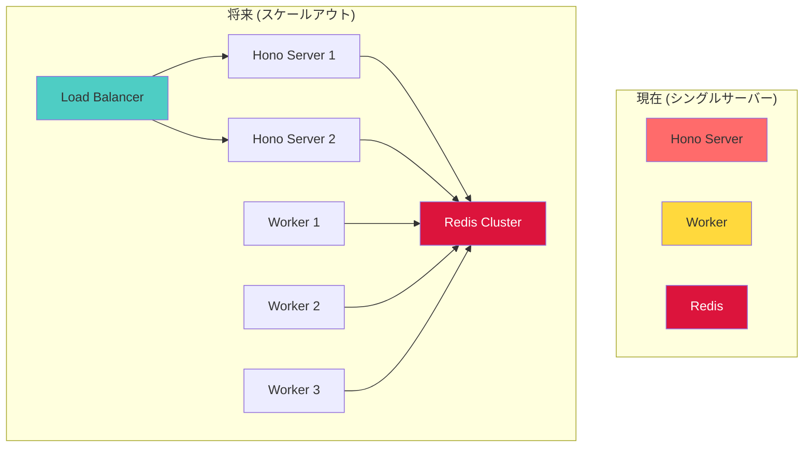

# アーキテクチャ概要

## システム全体図



## データフロー図

### 1. ファイルアップロードフロー



### 2. 手動入力フロー



## コンポーネント詳細図



## 技術スタック



**使用技術一覧:**

### フロントエンド
- **Vue.js 3** - UIフレームワーク
- **TypeScript** - 型安全な開発
- **Vite** - 高速ビルドツール
- **Socket.IO Client** - リアルタイム通信

### バックエンド
- **Hono** - 軽量Webフレームワーク
- **TypeScript** - 型安全な開発
- **Socket.IO Server** - リアルタイム通信
- **Bull** - ジョブキュー
- **@hono/node-server** - Node.jsサーバー

### データストア
- **Redis 7** - インメモリデータストア

### 外部サービス・ツール
- **VOICEVOX** - 音声合成エンジン
- **FFmpeg** - 動画処理
- **Puppeteer** - ブラウザ自動化

### ライブラリ
- **Marked** - Markdown処理
- **Axios** - HTTPクライアント
- **IORedis** - Redisクライアント
- **Multer** - ファイルアップロード
- **fs-extra** - ファイルシステム操作
- **glob** - ファイル検索


## デプロイメント構成



## ディレクトリ構造

```
presentation_maker/
├── src/                      # CLIモード (既存)
│   ├── services/
│   │   ├── voicevox.ts      # 音声生成サービス
│   │   ├── slide_renderer.ts # スライド画像生成
│   │   └── video_generator.ts # 動画生成・結合
│   ├── config.ts            # 環境変数設定
│   └── index.ts             # CLIエントリーポイント
│
├── server/                   # Webアプリバックエンド
│   ├── routes/
│   │   └── api.ts           # REST APIルート
│   ├── workers/
│   │   └── videoWorker.ts   # ジョブワーカー
│   ├── queue.ts             # Bullキュー設定
│   └── server.ts            # サーバーエントリーポイント
│
├── web/                      # Webアプリフロントエンド
│   ├── src/
│   │   ├── App.vue          # メインコンポーネント
│   │   └── main.ts          # エントリーポイント
│   ├── public/
│   └── dist/                # ビルド出力
│
├── docs/                     # ドキュメント
│   ├── API.md
│   ├── ARCHITECTURE.md      # このファイル
│   ├── CHANGELOG.md
│   ├── COMPONENT_DIAGRAM.md
│   ├── DEVELOPMENT.md
│   ├── REQUIREMENTS.md
│   ├── SPECIFICATIONS.md
│   ├── WEB_APP_SETUP.md
│   └── WSL2_DOCKER_REDIS.md
│
├── tests/                    # テスト
│   └── services/
│
├── input/                    # 入力ファイル (CLI)
├── output/                   # 出力ファイル (CLI)
├── public/                   # 公開ファイル (Web)
│   └── videos/              # 生成動画
│
├── docker-compose.yml        # Redis環境
├── start-redis.bat          # Redis起動 (Windows)
├── stop-redis.bat           # Redis停止 (Windows)
└── package.json             # 依存関係・スクリプト
```

## セキュリティ考慮事項



## パフォーマンス最適化

### キャッシング戦略



### ジョブキュー設定

- **並列処理**: 複数ワーカーで同時処理可能
- **優先度**: 将来的にユーザーごとの優先度設定
- **リトライ**: 失敗時の自動リトライ (Bull設定)
- **タイムアウト**: 長時間ジョブの自動キャンセル

## スケーラビリティ


