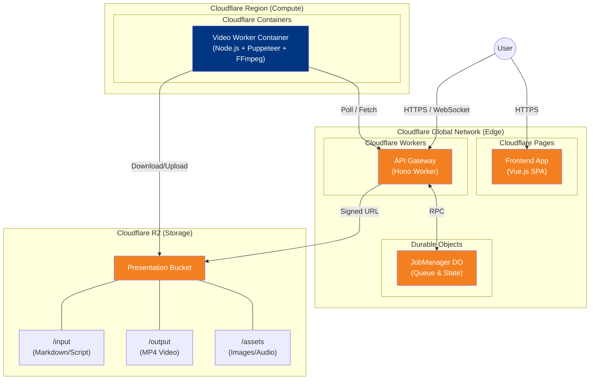
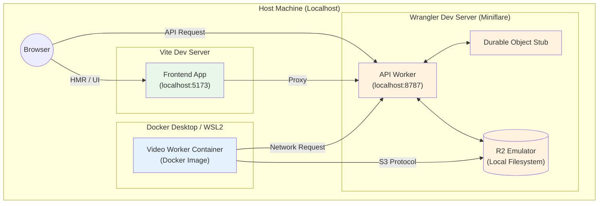
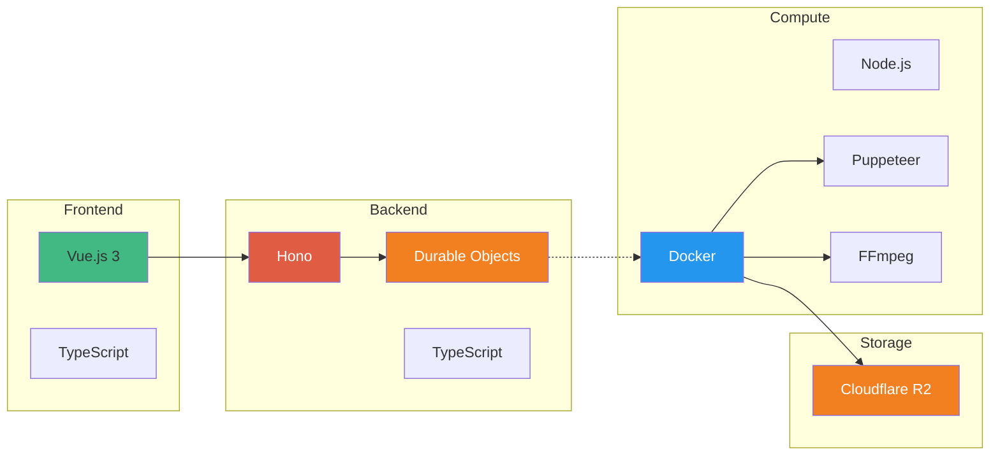

# アーキテクチャ概要

本ドキュメントでは、Presentation Makerのシステムアーキテクチャについて、デプロイメントとインフラストラクチャの視点から記述します。

## デプロイメントアーキテクチャ

### 1. 本番環境 (Production Environment)

Cloudflareの各サービス上にコンポーネントが分散配置されています。



**各サービスの役割:**

| サービス | コンポーネント | 役割 |
|---|---|---|
| **Cloudflare Pages** | Frontend App | Vue.js製のSPAホスティング。静的アセットの配信。 |
| **Cloudflare Workers** | API Gateway | HonoベースのREST API。認証、ルーティング、Durable Objectへのプロキシ。 |
| **Durable Objects** | JobManager | ジョブキューの管理、WebSocket接続の維持、ジョブ状態の永続化。 |
| **Cloudflare Containers** | Video Worker | 重い処理（Puppeteerによるレンダリング、FFmpegによる動画結合）を実行する環境。 |
| **Cloudflare R2** | Storage | ユーザーがアップロードした素材や、生成された動画ファイルの保存。 |

---

### 2. ローカル開発環境 (Local Development)

ローカルでは `wrangler` と `Docker` を組み合わせて本番環境をエミュレートします。



**ローカルでの動作:**
- **Workers/DO/R2**: `wrangler dev` (Miniflare) がこれらをエミュレートします。
- **Container**: ローカルのDockerエンジン上でコンテナを起動し、ホストのWranglerサーバーと通信させます。
- **Frontend**: `vite` サーバーで起動し、APIリクエストをWranglerへプロキシします。

## 技術スタック

(以下変更なし)



## ディレクトリ構造

```
presentation_maker/
├── src/                      # CLIモード / 共通ロジック
│   ├── services/             # 動画生成コアロジック
│   └── index.ts
│
├── workers/                  # Cloudflare Workers関連
│   ├── api/                  # API Worker (Hono)
│   ├── do/                   # Durable Objects (JobQueue)
│   └── container/            # Video Worker (Container)
│       ├── Dockerfile
│       ├── index.ts          # コンテナエントリーポイント
│       └── video-worker.ts   # 動画生成ロジック
│
├── web/                      # フロントエンド (Pages)
│   └── src/
│
├── docs/                     # ドキュメント
│   ├── ARCHITECTURE.md       # 本ファイル
│   ├── COMPONENT_DIAGRAM.md  # 詳細図
│   └── ...
│
└── input/                    # ローカルテスト用
```

## セキュリティ考慮事項

- **R2アクセス制御**:
  - Worker経由または署名付きURLでのみアクセス可能
  - パブリックアクセスは無効化
- **API認証**:
  - コンテナからAPIへのアクセスは環境変数によるトークン認証 (`CONTAINER_API_TOKEN`)
- **入力検証**:
  - ファイルサイズ制限
  - Markdownサニタイズ

## スケーラビリティ

- **Cloudflare Workers**: 自動的にスケール
- **Durable Objects**: グローバルに分散、整合性を保証
- **Cloudflare Containers**:
  - インスタンスタイプ（メモリ）を選択可能
  - 複数インスタンスによる並列処理が可能
- **R2**: 容量無制限のオブジェクトストレージ

## パフォーマンス最適化

- **エッジコンピューティング**: ユーザーに近い場所でAPI処理
- **コンテナメモリ**: Puppeteer用に `standard-1` (4GB) 以上を推奨
- **キャッシング**: 生成済み動画の再利用（ジョブIDベース）
