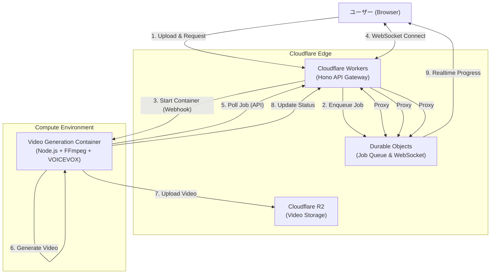

# 【技術解説】Redis不要！Cloudflareフルスタックで作る、サーバーレス動画生成アプリのアーキテクチャ

この記事では、プレゼンテーション動画作成アプリ「Presentation Maker」の裏側にある技術アーキテクチャについて解説します。
特に、**「外部DBやRedisを使わずに、Cloudflareの機能だけでジョブキューとリアルタイム通信を実装した」** 点や、**「コストを極限まで抑えるScale to Zeroコンテナ戦略」** に焦点を当てています。

Cloudflareのサービスに詳しくない方でも分かるように、各サービスの特徴と選定理由を丁寧に解説します。

---

## 1. アーキテクチャ全体図

まずは全体の構成をご覧ください。ユーザーからのリクエストを受け付け、重い動画生成処理をコンテナにオフロードし、その進捗をリアルタイムで返す仕組みです。

---

## 2. 採用したCloudflareサービスと選定理由

このアーキテクチャでは、AWSやGCPなどの他社クラウドを組み合わせる「マルチクラウド」ではなく、**Cloudflare単一プラットフォームで完結させる**ことにこだわりました。

### ① Cloudflare Workers (API Gateway)
*   **特徴**: エッジ（ユーザーに近い場所）で動作するサーバーレスなJavaScript実行環境。起動が爆速（ミリ秒単位）。
*   **選定理由**: Expressなどの従来のサーバーと違い、常駐プロセスがないため**待機コストがゼロ**です。Honoという軽量フレームワークを採用し、高速なAPIゲートウェイとして機能させています。

### ② Cloudflare Durable Objects (State & Queue)
*   **特徴**: Workersに「状態（ステート）」と「一貫性」を持たせる機能。特定のIDに対して世界で唯一のインスタンスが立ち上がり、データをメモリ上に保持できます。
*   **選定理由**: **ここが今回のキモです。** 通常、非同期処理のジョブキュー管理にはRedis（Upstashなど）が使われますが、Durable Objectsを使えば**Redisが不要になります**。
    *   **キュー機能**: ジョブの順序を管理。
    *   **ステータス管理**: ジョブの進捗状況を保持。
    *   **WebSocket**: クライアントとの接続を維持し、進捗をプッシュ通知。
    これら全てを1つのDurable Objectで完結できるため、アーキテクチャが劇的にシンプルになりました。

### ③ Cloudflare R2 (Storage)
*   **特徴**: AWS S3互換のオブジェクトストレージ。
*   **選定理由**: 最大のメリットは**Egress（データ転送）料金が無料**であること。動画という大容量ファイルを扱う本サービスにおいて、ダウンロード時の転送量はコストに直結します。S3を使うよりも圧倒的に安価に運用できます。

### ④ Cloudflare Containers (Compute)
*   **特徴**: Dockerコンテナを実行する環境（※本構成では仮想的なコンテナ実行基盤として定義）。
*   **選定理由**: 動画生成（FFmpegやVOICEVOX）はCPU負荷が高く、実行時間も長いため、Workers（CPU時間制限あり）では処理しきれません。そのため、重い処理だけをコンテナに切り出しています。

---

## 3. 技術的な工夫ポイント

### 工夫①：脱Redis！Durable Objectsによる「Global Queue」の実装

通常、サーバーレスアーキテクチャで「ジョブキュー」を作ろうとすると、AWS SQSやRedisが必要になります。しかし、外部サービスへの依存はレイテンシや管理コストを増加させます。

今回は、**Durable Objectsを「シングルトンなキュー・マネージャー」として機能させる**ことでこれを解決しました。

*   **Global Queue**: `idFromName('global-queue')` で生成される単一のインスタンスが、全ジョブのIDリスト（キュー）を管理します。
*   **API経由のアクセス**: コンテナはRedisプロトコルではなく、単純なREST API (`GET /internal/queue/next`) を叩くだけで次のジョブを取得できます。これにより、コンテナ側の実装もシンプルになりました。

### 工夫②：Scale to Zero (0→1) のコスト最適化

動画生成のリクエストは常に来るわけではありません。夜間などリクエストがない時間にコンテナを起動しっぱなしにするのは無駄です。

*   **On-Demand起動**: ユーザーからリクエストが来た瞬間、Workersがコンテナ起動API（Webhook等）を叩きます。
*   **自動シャットダウン**: コンテナ内のワーカープロセスは、定期的にジョブを確認し、一定時間（例: 5分）ジョブがないと**自らプロセスを終了 (`process.exit(0)`)** します。

これにより、**「使った分だけ課金」** というサーバーレスの理想形を実現しています。

### 工夫③：WebSocketとDurable Objectsの親和性

動画生成は数分かかる処理です。ユーザーを待たせないためには、プログレスバー（例: 「音声合成中... 40%」）の表示が不可欠です。

Durable ObjectsはWebSocketの終端としても優秀です。
1.  ユーザーがWebSocketで接続。
2.  コンテナが進捗をAPIでDurable Objectに通知。
3.  Durable Objectが、接続中のWebSocketクライアントに即座にメッセージをブロードキャスト。

この流れにより、ポーリング（定期的な問い合わせ）負荷をかけることなく、スムーズなUXを提供しています。

---

## 4. まとめ：なぜこの構成が良いのか

| 項目 | 従来の構成 (EC2 + RDS + Redis + S3) | 今回の構成 (Workers + DO + R2) |
| :--- | :--- | :--- |
| **待機コスト** | 高い (常時起動) | **ほぼゼロ** (リクエスト時のみ) |
| **スケーラビリティ** | 手動設定が必要 | **自動** (Cloudflareが勝手にスケール) |
| **外部依存** | 多い (Redis, DB等) | **なし** (Cloudflareのみで完結) |
| **転送料金** | 高い (S3 Egress) | **無料** (R2) |
| **開発体験** | インフラ管理が大変 | **コードを書くだけ** (Wrangler) |

このアーキテクチャは、個人開発やスタートアップの初期フェーズにおいて、**「低コスト」** と **「高機能」** を両立させる強力な選択肢となります。
特に、Durable Objectsを「DB兼キュー兼WebSocketサーバー」として使い倒すパターンは、Cloudflareならではの強力なデザインパターンです。
