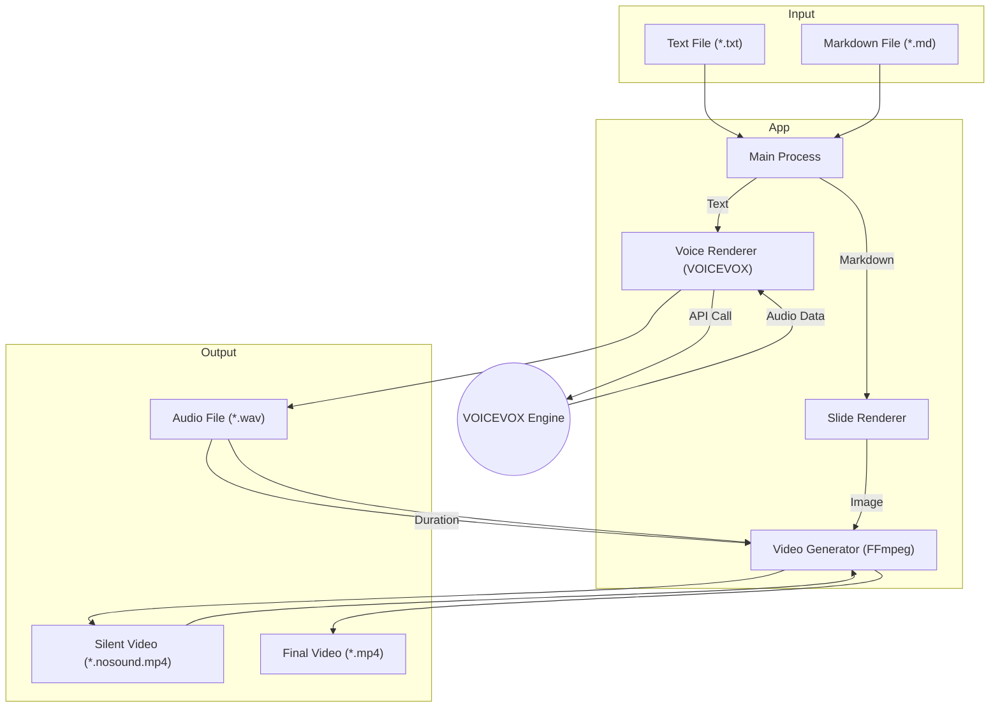

```mermaid
graph TD
    subgraph Input
        MD["Markdown File (*.md)"]
        TXT["Text File (*.txt)"]
    end

    subgraph App
        Main[Main Process]
        VR["Voice Renderer (VOICEVOX)"]
        SR[Slide Renderer]
        VG["Video Generator (FFmpeg)"]
    end

    subgraph Output
        WAV["Audio File (*.wav)"]
        NSMP4["Silent Video (*.nosound.mp4)"]
        MP4["Final Video (*.mp4)"]
    end

    TXT --> Main
    MD --> Main

    Main -->|Text| VR
    VR -->|API Call| VOICEVOX((VOICEVOX Engine))
    VOICEVOX -->|Audio Data| VR
    VR --> WAV

    Main -->|Markdown| SR
    SR -->|Image| VG
    WAV -->|Duration| VG
    VG --> NSMP4

    WAV --> VG
    NSMP4 --> VG
    VG --> MP4
```