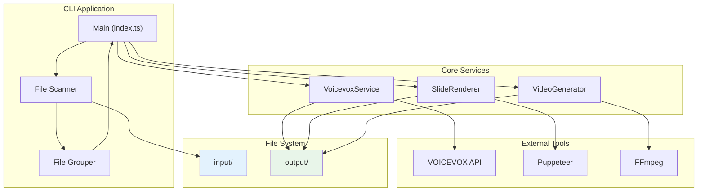
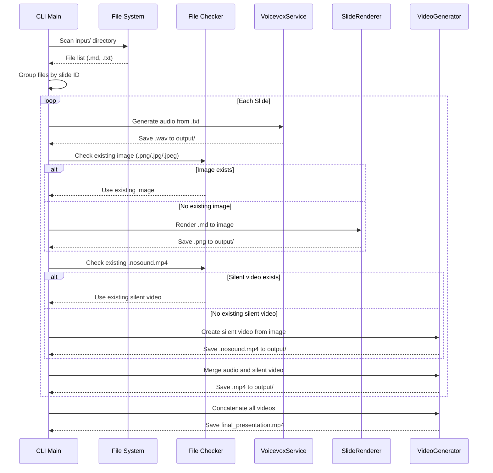
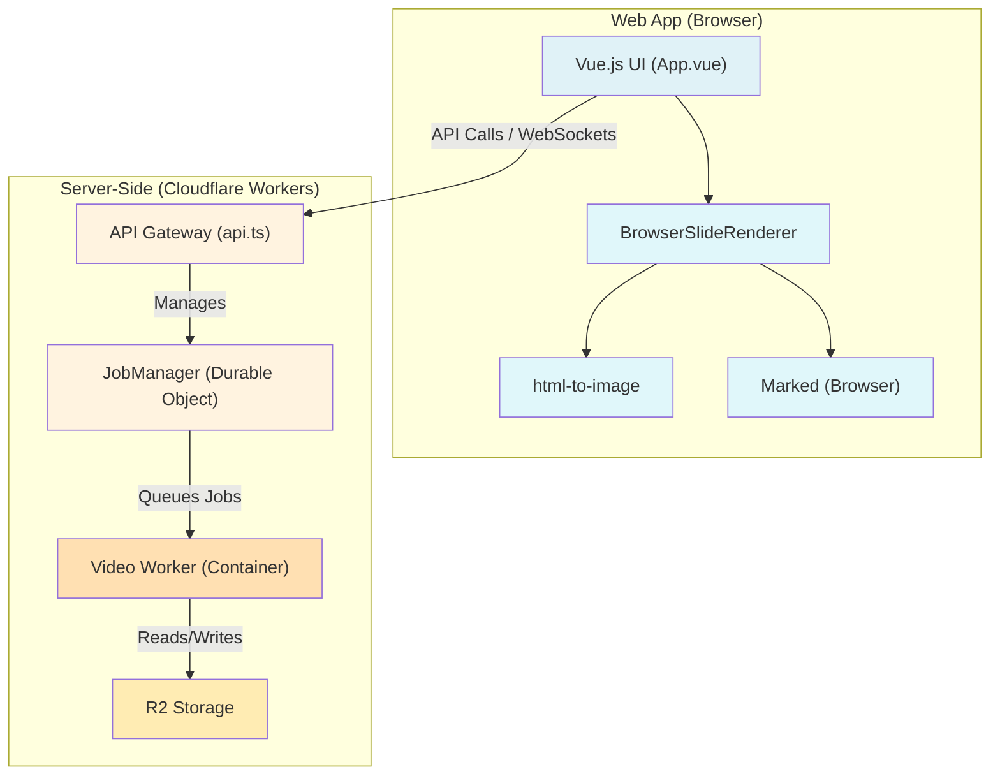
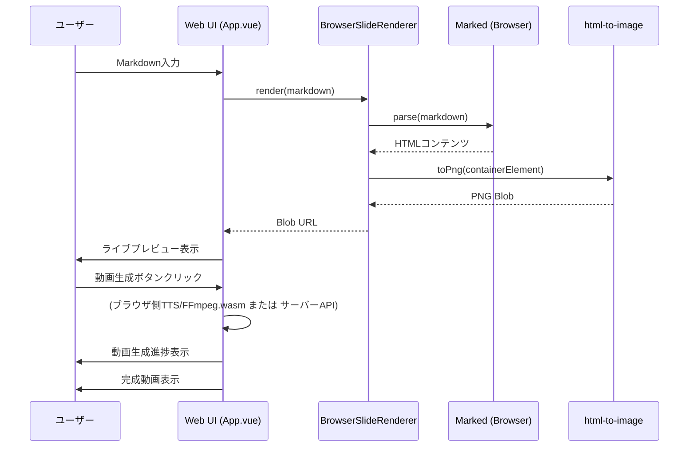
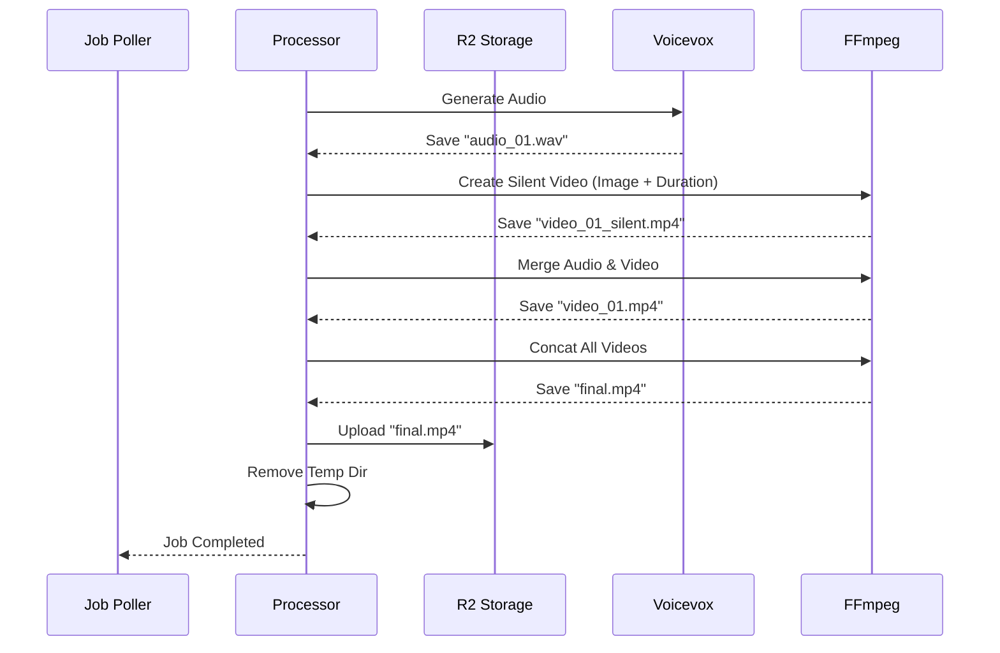

# コンポーネント図

## 1. CLIモードのコンポーネント構成

CLIモードでのローカル実行時のコンポーネント構成と処理フローです。



### CLIモード処理フロー



### CLIモード ファイル構成

```
project_root/
├── input/
│   ├── {番号}__{タイトル}.md    # スライド（Markdown）
│   └── {番号}__{タイトル}.txt   # 台本（テキスト）
│
└── output/
    ├── {番号}__{タイトル}.wav           # 生成: 音声
    ├── {番号}__{タイトル}.png           # 生成: スライド画像
    ├── {番号}__{タイトル}.jpg           # または事前準備済み画像
    ├── {番号}__{タイトル}.nosound.mp4   # 生成または事前準備済み: 無音動画
    ├── {番号}__{タイトル}.mp4           # 生成: 結合動画
    └── final_presentation.mp4           # 生成: 最終成果物
```

---



### Webアプリモード処理フロー (ライブプレビュー含む)



## 3. 動画生成詳細シーケンス (Container Internal)

Video Workerコンテナ内部での処理フローとファイル操作の詳細です。



## 4. データモデル (Durable Object State)

JobManagerが保持する状態データの構造です。

```typescript
// Job State stored in Durable Object
interface JobState {
  id: string;
  status: 'pending' | 'processing' | 'completed' | 'failed';
  progress: number; // 0-100
  createdAt: number;
  updatedAt: number;
  resultUrl?: string; // R2 Public URL or Signed URL
  error?: string;
}

// Queue Structure
type JobQueue = string[]; // List of Job IDs
```

## 5. ファイルパス構成 (R2 & Container)

### R2 Storage Structure
```
bucket/
  ├── jobs/
  │   └── {jobId}/
  │       ├── uploads/
  │       │   ├── {slideId}__{title}.md
  │       │   └── {slideId}__{title}.txt
  │       │
  │       ├── 0{slideId}__{title}.nosound.mp4
  │       ├── 0{slideId}__{title}.mp4
  │       └── final_presentation.mp4
```

### Container Temp Directory
```
/app/
  ├── temp/
  │   └── {jobId}/
  │       ├── {slideId}__{title}.md
  │       ├── {slideId}__{title}.txt
  │       └── {slideId}__{title}.png
  │
  └── output/
      └── {jobId}/
          ├── {slideId}__{title}.wav
          ├── {slideId}__{title}.nosound.mp4
          ├── {slideId}__{title}.mp4
          └── final_presentation.mp4
```
