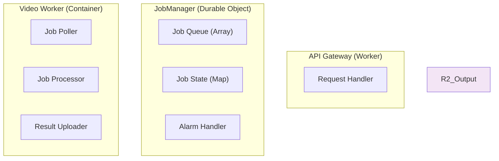

主要なコンポーネント間のメッセージングとデータフローの詳細です。



## 2. 動画生成詳細シーケンス (Container Internal)

Video Workerコンテナ内部での処理フローとファイル操作の詳細です。

```mermaid
sequenceDiagram
    participant Poller as Job Poller
    participant Proc as Processor
    participant R2 as R2 Storage
        Voicevox-->>Proc: Save "audio_01.wav"
        
        Proc->>FFmpeg: Create Silent Video (Image + Duration)
        FFmpeg-->>Proc: Save "video_01_silent.mp4"
        
        Proc->>FFmpeg: Merge Audio & Video
        FFmpeg-->>Proc: Save "video_01.mp4"
    end
    
    %% 3. Concatenation
    Proc->>FFmpeg: Concat All Videos
    FFmpeg-->>Proc: Save "final.mp4"
    
    %% 4. Upload & Cleanup
    Proc->>R2: Upload "final.mp4"
    Proc->>Proc: Remove Temp Dir
    Proc-->>Poller: Job Completed
```

## 3. データモデル (Durable Object State)

JobManagerが保持する状態データの構造です。

```typescript
// Job State stored in Durable Object
interface JobState {
  id: string;
  status: 'pending' | 'processing' | 'completed' | 'failed';
  progress: number; // 0-100
  createdAt: number;
  updatedAt: number;
  resultUrl?: string; // R2 Public URL or Signed URL
  error?: string;

主要なコンポーネント間のメッセージングとデータフローの詳細です。


## 2. 動画生成詳細シーケンス (Container Internal)

Video Workerコンテナ内部での処理フローとファイル操作の詳細です。

```mermaid
sequenceDiagram
    participant Poller as Job Poller
    participant Proc as Processor
    participant R2 as R2 Storage
        Voicevox-->>Proc: Save "audio_01.wav"
        
        Proc->>FFmpeg: Create Silent Video (Image + Duration)
        FFmpeg-->>Proc: Save "video_01_silent.mp4"
        
        Proc->>FFmpeg: Merge Audio & Video
        FFmpeg-->>Proc: Save "video_01.mp4"
    end
    
    %% 3. Concatenation
    Proc->>FFmpeg: Concat All Videos
    FFmpeg-->>Proc: Save "final.mp4"
    
    %% 4. Upload & Cleanup
    Proc->>R2: Upload "final.mp4"
    Proc->>Proc: Remove Temp Dir
    Proc-->>Poller: Job Completed
```

## 3. データモデル (Durable Object State)

JobManagerが保持する状態データの構造です。

```typescript
// Job State stored in Durable Object
interface JobState {
  id: string;
  status: 'pending' | 'processing' | 'completed' | 'failed';
  progress: number; // 0-100
  createdAt: number;
  updatedAt: number;
  resultUrl?: string; // R2 Public URL or Signed URL
  error?: string;
}

// Queue Structure
type JobQueue = string[]; // List of Job IDs
```

## 4. ファイルパス構成 (R2 & Container)

### R2 Storage Structure
```
bucket/
  ├── jobs/
  │   └── {jobId}/
  │       ├── uploads/
  │       │   ├── {slideId}__{title}.md
  │       │   └── {slideId}__{title}.txt
  │       │
  │       ├── 0{slideId}__{title}.nosound.mp4
  │       ├── 0{slideId}__{title}.mp4
  │       └── final_presentation.mp4
```

### Container Temp Directory
```
/app/
  ├── temp/
  │   └── {jobId}/
  │       ├── {slideId}__{title}.md
  │       ├── {slideId}__{title}.txt
  │       └── {slideId}__{title}.png
  │
  └── output/
      └── {jobId}/
          ├── {slideId}__{title}.wav
          ├── {slideId}__{title}.nosound.mp4
          ├── {slideId}__{title}.mp4
          └── final_presentation.mp4
```